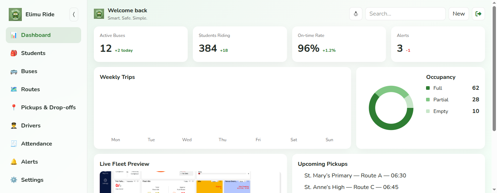

# Elimu Ride Frontend

**Elimu Ride** is an extension of the **Elimu Rise ERP**, designed to simplify school transport management in schools.  

It unifies **route planning**, **trip tracking**, and **vehicle management** in a clean, high-performance interface powered by **React** and **Waku’s edge-native architecture**.

---

## 🚀 Core Highlights

- ⚡ **Built with Waku JS** — fast SSR, routing, and hydration by default  
- 📱 **Mobile-first UI** — designed for students and drivers on the move  
- 🧭 **Real-time Trip Tracking** — monitor trip progress and vehicle usage by Google Maps Live APIs.
- 🧩 **Modular API Integration** — seamlessly connects to a scalable backend framework (Frappe Framework)
- 👨‍🏫 **Role-based Dashboards** — distinct views for parents, drivers, administrators and other users.  
- 🎨 **Modern Design System** — inspired by attention to detail and simplicity  

---

## 🧠 Tech Stack

| Layer | Technology |
|-------|-------------|
| **Frontend Framework** | Waku JS (React + Edge-SSR) |
| **Styling** | TailwindCSS |
| **Data Layer** | REST / JWT APIs |
| **State Management** | React Context / Hooks |
| **Backend Integration** | Frappe ERPNext APIs |

---

## 🌍 Vision

> *“Empowering schools and families through smart mobility.”*

Elimu Ride redefines how schools handle student transportation — from daily pickups to long-distance trips — ensuring **safety**, **transparency**, and **digital convenience**.

---

## 🧩 Preview



---

## ⚙️ Getting Started

```bash
# Clone the repository
git clone https://github.com/johnnzamba/Elimu-Ride-Frontend.git

# Navigate to the project directory
cd elimu-ride-frontend

# Install dependencies
npm install

# Run the development server
npm run dev
